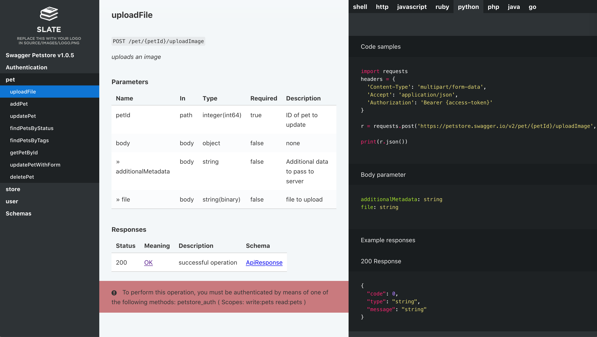

[](https://pypi.org/project/foliantcontrib.swaggerdoc/)  [](https://github.com/foliant-docs/foliantcontrib.swaggerdoc)

# Swagger API Docs Generator for Foliant



*The static site on the picture was built with [Slate](https://foliant-docs.github.io/docs/backends/slate/) backend together with SwaggerDoc preprocessor*

This preprocessor generates Markdown documentation from [Swagger](https://swagger.io/) spec files. It uses [Jinja2](http://jinja.pocoo.org/) templating engine or [Widdershins](https://github.com/mermade/widdershins) for generating Markdown from swagger spec files.

## Installation

```bash
$ pip install foliantcontrib.swaggerdoc
```

This preprocessor requires [Widdershins](https://github.com/Mermade/widdershins) to be installed on your system (unless you are using [Foliant with Full Docker Image](https://foliant-docs.github.io/docs/tutorials/full_docker/)):

```
npm install -g widdershins
```

## Config

To enable the preprocessor, add `swaggerdoc` to `preprocessors` section in the project config:

```yaml
preprocessors:
    - swaggerdoc
```

The preprocessor has a number of options:

```yaml
preprocessors:
    - swaggerdoc:
        spec_url: http://localhost/swagger.json
        spec_path: swagger.json
        additional_json_path: tags.json
        mode: widdershins
        template: swagger.j2
        environment: env.yaml

```

`spec_url`
:    URL to Swagger spec file. If it is a list — preprocessor takes the first url which works.

`spec_path`
:    Local path to Swagger spec file (relative to project dir).

> If both url and path are specified — preprocessor first tries to fetch spec from url, and then (if that fails) looks for the file on local path.

`additional_json_path`
:    Only for `jinja` mode. Local path to swagger spec file with additional info (relative to project dir). It will be merged into original spec file, *not overriding existing fields*.

`mode`
:   Determines how the Swagger spec file would be converted to markdown. Should be one of: `jinja`, `widdershins`. Default: `widdershins`

> `jinja` mode is deprecated. It may be removed in future

`template`
:   Only for `jinja` mode. Path to jinja-template for rendering the generated documentation. Path is relative to the project directory. If no template is specified preprocessor will use default template (and put it into project dir if it was missing). Default: `swagger.j2`

`environment`
:   Only for `widdershins` mode. Parameters for widdershins converter. You can either pass a string containing relative path to YAML or JSON file with all parameters (like in example above) or specify all parameters in YAML format under this key. [More info](https://github.com/mermade/widdershins) on widdershins parameters.

## Usage

Add a `<swaggerdoc></swaggerdoc>` tag at the position in the document where the generated documentation should be inserted:

```markdown
# Introduction

This document contains the automatically generated documentation of our API.

<swaggerdoc></swaggerdoc>
```

Each time the preprocessor encounters the tag `<swaggerdoc></swaggerdoc>` it inserts the whole generated documentation text instead of it. The path or url to Swagger spec file are taken from foliant.yml.

You can also specify some parameters (or all of them) in the tag options:

```markdown
# Introduction

Introduction text for API documentation.

<swaggerdoc spec_url="http://localhost/swagger.json"
            mode="jinja"
            template="swagger.j2">
</swaggerdoc>

<swaggerdoc spec_url="http://localhost/swagger.json"
            mode="widdershins"
            environment="env.yml">
</swaggerdoc>
```

Tag parameters have the highest priority.

This way you can have documentation from several different Swagger spec files in one foliant project (even in one md-file if you like it so).

## Customizing output

### Widdershins

In `widdershins` mode the output markdown is generated by [widdershins](https://github.com/mermade/widdershins) Node.js application. It supports customizing the output with [doT.js](https://github.com/olado/doT) templates.

1. Clone the original widdershins [repository](https://github.com/mermade/widdershins) and modify the templates located in one of the subfolders in the **templates** folder.
2. Save the modified templates somewhere near your foliant project.
3. Specify the path to modified templates in the `user_templates` field of the `environment` configuration. For example, like this:

```yaml
preprocessors:
    - swaggerdoc:
        spec_path: swagger.yml
        environment:
            user_templates: !path ./widdershins_templates/
```

### Jinja

> `jinja` mode is deprecated. It may be removed in future

In `jinja` mode the output markdown is generated by the [Jinja2](http://jinja.pocoo.org/) template. In this template all fields from Swagger spec file are available under the dictionary named `swagger_data`.

To customize the output create a template which suits your needs. Then supply the path to it in the `template` parameter.

If you wish to use the default template as a starting point, build the foliant project with `swaggerdoc` preprocessor turned on. After the first build the default template will appear in your foliant project dir under name `swagger.j2`.
